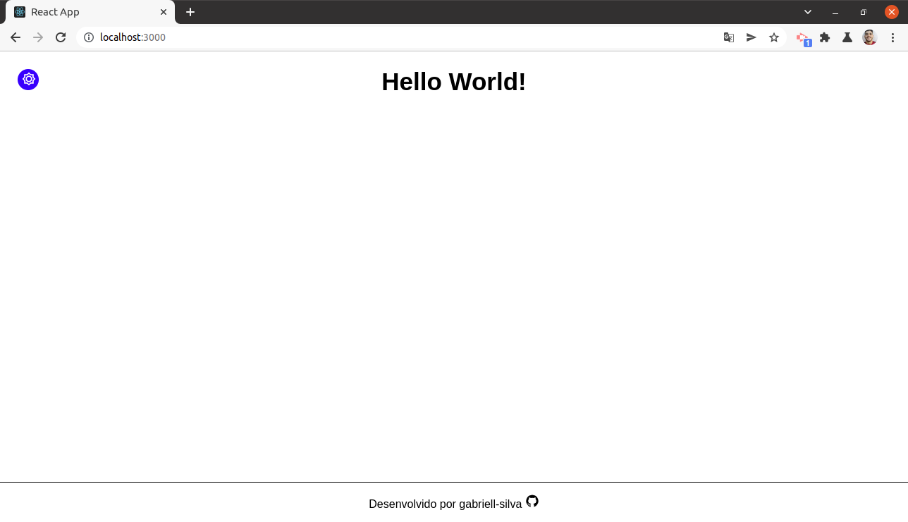
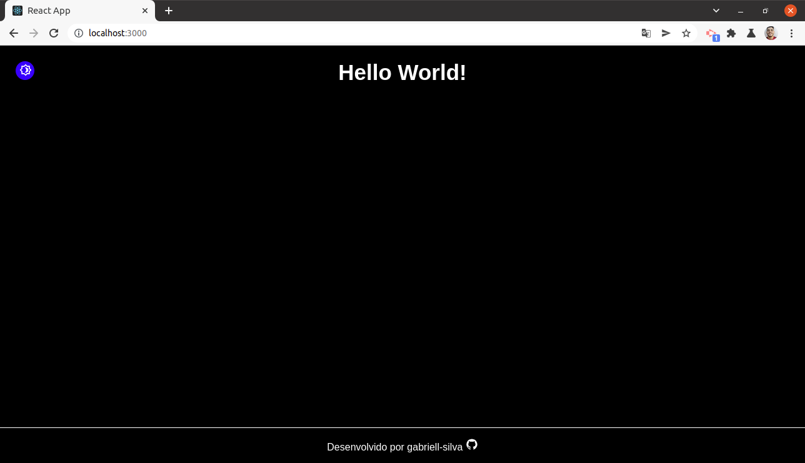

# Hello World React JS

<<<<<<< HEAD
Final Design

Light

Dark

=======
[!({https://github.com/gabriell-silva/hello-world-reactjs/blob/main/public/React%20App.webm} "Final Design")
>>>>>>> f260e6e1117ee8c26207564dc00c8ee22856c8d0
